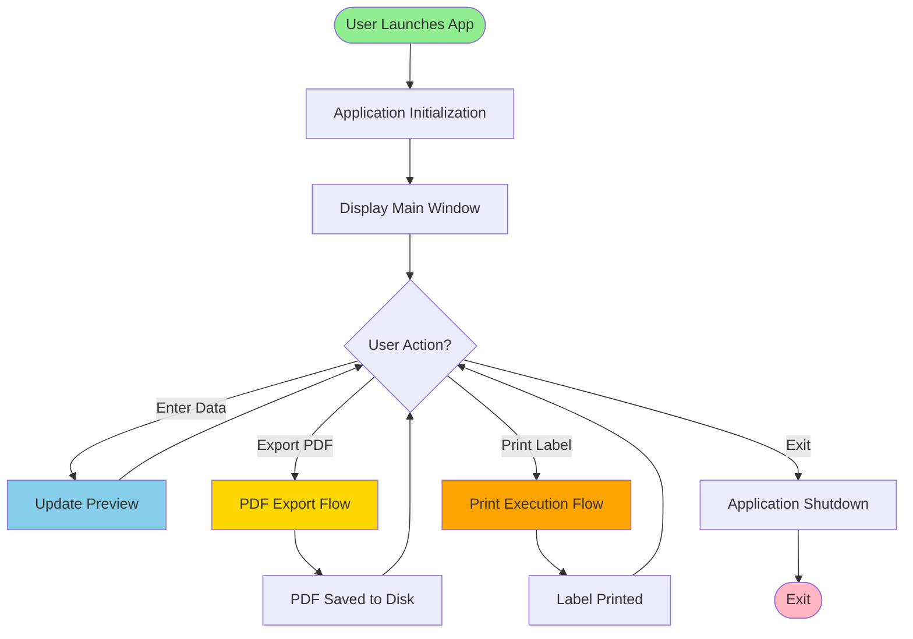
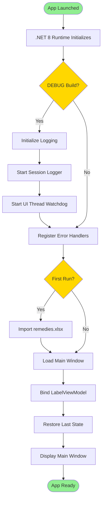
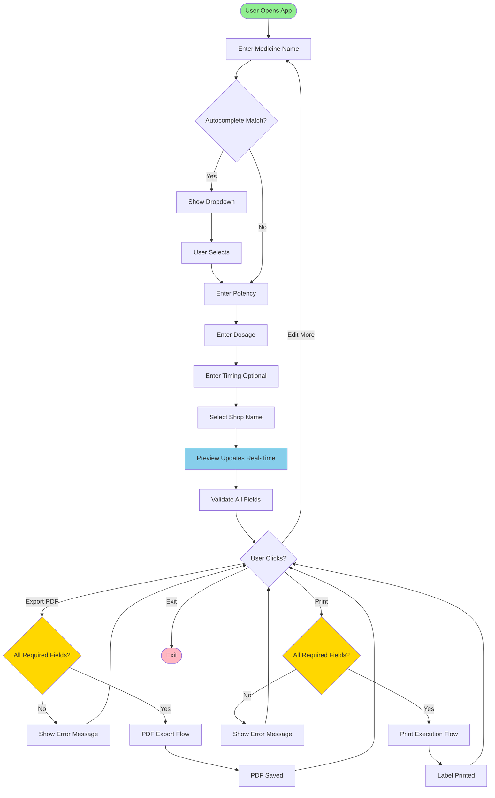
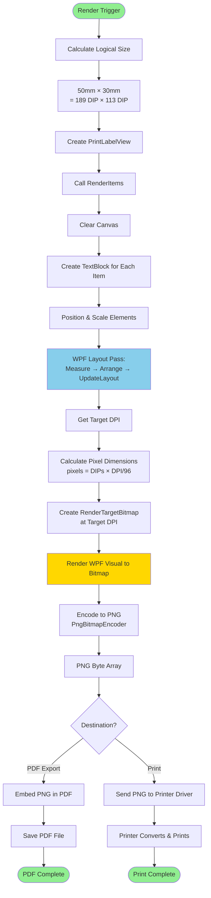
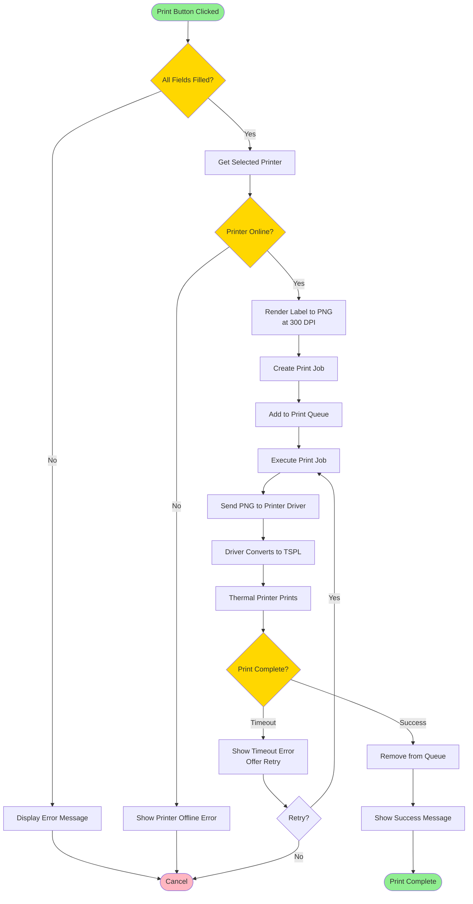
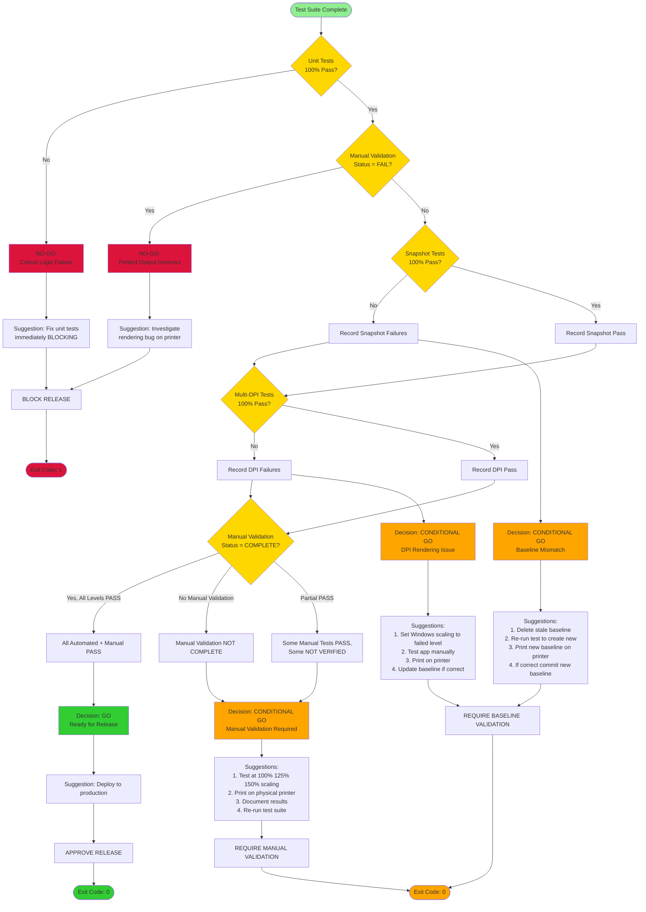

```mermaid
flowchart TB
    Start([Run Test Suite]) --> CollectEnv[Collect Environment Info<br/>OS, DPI, Machine Name]
    CollectEnv --> RunUnit[Execute Unit Tests<br/>Category=Unit]
    
    RunUnit --> UnitResult{All Pass?}
    UnitResult -->|No| UnitFail[Record Failures]
    UnitFail --> DecisionNoGo[Decision: NO-GO]
    DecisionNoGo --> GenerateReport
    
    UnitResult -->|Yes| RunSnapshot[Execute Snapshot Tests<br/>Category=Snapshot]
    RunSnapshot --> SnapshotResult{All Pass?}
    
    SnapshotResult -->|No| RecordSnapshotFail[Record Baseline Mismatches]
    SnapshotResult -->|Yes| RecordSnapshotPass[Record Pass]
    
    RecordSnapshotFail --> RunDPI
    RecordSnapshotPass --> RunDPI[Execute Multi-DPI Tests<br/>Category=DPI]
    
    RunDPI --> DPILoop[For Each DPI 96, 120, 144]
    DPILoop --> RenderAtDPI[Render at Target DPI]
    RenderAtDPI --> ValidateDimensions[Validate Pixel Dimensions]
    ValidateDimensions --> ValidatePhysical[Validate Physical Size]
    ValidatePhysical --> CompareBaseline[Compare to Baseline]
    CompareBaseline --> NextDPI{More DPI Levels?}
    
    NextDPI -->|Yes| DPILoop
    NextDPI -->|No| CheckPerf[Collect Performance Metrics]
    
    CheckPerf --> CheckManual[Check Manual Validation File]
    CheckManual --> ManualExists{File Exists?}
    
    ManualExists -->|Yes| ParseManual[Parse Validation Results]
    ParseManual --> ManualComplete{All Levels PASS?}
    ManualComplete -->|Yes| AllPassManual[Manual Validation Complete]
    ManualComplete -->|No| ManualPending[Manual Validation Partial/Failed]
    
    ManualExists -->|No| ManualPending
    
    AllPassManual --> AnalyzeResults
    ManualPending --> AnalyzeResults[Analyze All Results]
    
    AnalyzeResults --> DetermineDecision{Decision Logic}
    
    DetermineDecision -->|All Tests Pass + Manual Complete| DecisionGo[Decision: GO]
    DetermineDecision -->|Tests Pass, Manual Pending| DecisionConditional[Decision: CONDITIONAL GO]
    DetermineDecision -->|Rendering Fail, Manual Incomplete| DecisionConditional
    
    DecisionGo --> GenerateReport[Generate Test Report]
    DecisionConditional --> GenerateReport
    
    GenerateReport --> SaveDesktop[Save to Desktop<br/>HomeoLabel_TestReport_*.log]
    SaveDesktop --> PrintSummary[Print Console Summary]
    PrintSummary --> End([Test Complete])
    
    style Start fill:#90EE90
    style End fill:#90EE90
    style UnitResult fill:#FFD700
    style SnapshotResult fill:#FFD700
    style ManualExists fill:#FFD700
    style ManualComplete fill:#FFD700
    style DetermineDecision fill:#FF6347
    style DecisionGo fill:#32CD32
    style DecisionConditional fill:#FFA500
    style DecisionNoGo fill:#DC143C
```

```mermaid
flowchart TD
    Start([CONDITIONAL GO Decision]) --> ReadGuide[Read MULTI_DPI_TESTING_GUIDE.md]
    ReadGuide --> SetScaling100[Set Windows Scaling to 100%]
    
    SetScaling100 --> Logout1[Log Out & Log Back In]
    Logout1 --> LaunchApp1[Launch Application]
    LaunchApp1 --> EnterTest1[Enter Standard Test Label:<br/>ARNICA MONTANA, 200 CH, etc.]
    
    EnterTest1 --> Preview1[Check Preview]
    Preview1 --> ExportPDF1[Export to PDF]
    ExportPDF1 --> PrintPDF1[Print PDF from Viewer]
    PrintPDF1 --> PrintDirect1[Print Directly from App]
    
    PrintDirect1 --> Validate1{All 3 Outputs Match?}
    Validate1 -->|No| Fail1[Document FAIL<br/>Investigate Issue]
    Fail1 --> NoGo[Change Decision to NO-GO]
    NoGo --> EndFail([Block Release])
    
    Validate1 -->|Yes| Document1[Document PASS in Manual_DPI_Test_Results.md]
    Document1 --> SetScaling125[Set Windows Scaling to 125%]
    
    SetScaling125 --> Logout2[Log Out & Log Back In]
    Logout2 --> LaunchApp2[Launch Application]
    LaunchApp2 --> EnterTest2[Enter Same Test Label]
    EnterTest2 --> Preview2[Check Preview]
    Preview2 --> ExportPDF2[Export to PDF]
    ExportPDF2 --> PrintPDF2[Print PDF from Viewer]
    PrintPDF2 --> PrintDirect2[Print Directly from App]
    
    PrintDirect2 --> Validate2{All 3 Outputs Match?}
    Validate2 -->|No| Fail2[Document FAIL]
    Fail2 --> NoGo
    
    Validate2 -->|Yes| Document2[Document PASS]
    Document2 --> SetScaling150[Set Windows Scaling to 150%]
    
    SetScaling150 --> Logout3[Log Out & Log Back In]
    Logout3 --> LaunchApp3[Launch Application]
    LaunchApp3 --> EnterTest3[Enter Same Test Label]
    EnterTest3 --> Preview3[Check Preview]
    Preview3 --> ExportPDF3[Export to PDF]
    ExportPDF3 --> PrintPDF3[Print PDF from Viewer]
    PrintPDF3 --> PrintDirect3[Print Directly from App]
    
    PrintDirect3 --> Validate3{All 3 Outputs Match?}
    Validate3 -->|No| Fail3[Document FAIL]
    Fail3 --> NoGo
    
    Validate3 -->|Yes| Document3[Document PASS]
    Document3 --> AllComplete[All 3 Levels PASS]
    AllComplete --> RerunTests[Re-Run Test Suite]
    
    RerunTests --> NewDecision[New Decision: GO]
    NewDecision --> EndGo([Approve Release])
    
    style Start fill:#FFA500
    style EndGo fill:#32CD32
    style EndFail fill:#DC143C
    style Validate1 fill:#FFD700
    style Validate2 fill:#FFD700
    style Validate3 fill:#FFD700
    style NoGo fill:#DC143C
    style NewDecision fill:#32CD32
```

# HomeoMahanagarLabelCleanV2 - Project Flowcharts

**Document Version:** 1.0  
**Date:** January 2024  
**Document Type:** Visual Process Documentation  
**Format:** Mermaid Diagrams + ASCII Flowcharts  

---

## Introduction

This document provides visual flowcharts for all major processes in the HomeoMahanagarLabelCleanV2 system. Flowcharts use Mermaid diagram syntax (renderable in GitHub, VS Code, and documentation tools).

**Flowcharts Included:**
1. High-Level System Flowchart
2. Application Startup Flowchart
3. User Interaction Flowchart
4. Rendering Pipeline Flowchart
5. Print Execution Flowchart
6. Test Execution Flowchart
7. Release Decision Flowchart

---

## Flowchart 1: High-Level System Overview

### Mermaid Diagram



### Description

**Flow:** User launches app → Main window displayed → User performs actions (enter data, export PDF, print, or exit)

**Key Decision Points:**
- User action determines next flow (preview update, PDF export, print, or exit)

---

## Flowchart 2: Application Startup Flow

### Mermaid Diagram



### Description

**Conditional Flows:**
- **DEBUG Build:** Extra logging and monitoring enabled
- **Release Build:** Minimal overhead, direct to main window
- **First Run:** Import medicine database from Excel

**Duration:** < 5 seconds

---

## Flowchart 3: User Interaction Flow (Input → Preview → Print)

### Mermaid Diagram



### Description

**Real-Time Preview:** Every input change triggers preview update (< 100ms)

**Validation Gates:** PDF export and print require all mandatory fields filled

---

## Flowchart 4: Rendering Pipeline Flow (WPF → DPI → Bitmap)

### Mermaid Diagram



### Description

**Key Insight:** WPF visual remains DPI-independent. Only the final bitmap rasterization depends on target DPI (300 for PDF/print, varies for screen display).

**Critical Path:** Measure → Arrange → UpdateLayout **MUST** complete before rendering, or positions will be incorrect.

---

## Flowchart 5: Print Execution Flow

### Mermaid Diagram



### Description

**Error Handling:** Multiple validation gates (fields, printer status, completion)

**Retry Logic:** Timeout allows user to retry print operation

**Duration:** 2-5 seconds (typical)

---

## Flowchart 6: Test Execution Flow

### Mermaid Diagram



### Description

**Decision Gates:**
- **Unit Test Failure:** Immediate NO-GO (critical logic broken)
- **Rendering Failures:** CONDITIONAL GO (requires manual validation)
- **All Pass + Manual Complete:** GO (ready for release)

**Duration:** 8-15 seconds

---

## Flowchart 7: Release Decision Flowchart (GO / CONDITIONAL GO / NO-GO)

### Mermaid Diagram



### Description

**Decision Logic:**

1. **NO-GO (Red):** Critical failures
   - Unit tests failed
   - Manual validation failed (printed output wrong)
   - **Action:** Block release, fix issues

2. **GO (Green):** All gates passed
   - All automated tests passed
   - Manual validation complete and passed
   - **Action:** Approve release

3. **CONDITIONAL GO (Orange):** Manual intervention needed
   - Tests passed but manual validation pending
   - Rendering failures (snapshot/DPI) requiring physical printer validation
   - **Action:** Complete manual validation before release

---

## Flowchart 8: Manual Validation Workflow

### Mermaid Diagram



### Description

**Critical Steps:**
1. **Log out/log in** after changing Windows scaling (required for DPI changes to take effect)
2. **Test all 3 output paths:** Preview, PDF print, direct print (all must match)
3. **Document results** in Markdown file (parseable by test suite)

**Duration:** 1-2 hours (for all 3 scaling levels)

---

## ASCII Flowchart Summary (High-Level System)

```
┌─────────────────────────────────────────────────┐
│              USER LAUNCHES APP                  │
└───────────────────┬─────────────────────────────┘
                    │
                    ▼
┌─────────────────────────────────────────────────┐
│         APPLICATION INITIALIZATION              │
│  - Load .NET Runtime                            │
│  - Initialize Logging (DEBUG)                   │
│  - Load Medicine Database                       │
│  - Display Main Window                          │
└───────────────────┬─────────────────────────────┘
                    │
                    ▼
┌─────────────────────────────────────────────────┐
│          MAIN UI (User Interaction)             │
│                                                 │
│  ┌──────────┐  ┌──────────┐  ┌──────────┐     │
│  │  Enter   │  │  Export  │  │  Print   │     │
│  │   Data   │  │   PDF    │  │  Label   │     │
│  └────┬─────┘  └────┬─────┘  └────┬─────┘     │
│       │             │             │             │
└───────┼─────────────┼─────────────┼─────────────┘
        │             │             │
        ▼             ▼             ▼
  ┌─────────┐   ┌─────────┐   ┌─────────┐
  │ Preview │   │   PDF   │   │  Print  │
  │ Updates │   │  Export │   │  Queue  │
  │(Real-Time)  │  Flow   │   │  Flow   │
  └─────────┘   └─────────┘   └─────────┘
                      │             │
                      ▼             ▼
                ┌─────────┐   ┌─────────┐
                │PDF File │   │Physical │
                │ Saved   │   │ Label   │
                └─────────┘   └─────────┘
```

---

## Summary Table: Decision Points & Actions

| Decision Point | Condition | Action |
|----------------|-----------|--------|
| **Unit Test Result** | All pass | Continue to next tests |
|  | Any fail | NO-GO, block release |
| **Snapshot Test Result** | All pass | Mark as validated |
|  | Any fail | CONDITIONAL GO, validate baseline on printer |
| **Multi-DPI Test Result** | All pass | Mark as validated |
|  | Any fail | CONDITIONAL GO, test at specific DPI manually |
| **Manual Validation Status** | All levels PASS | GO, approve release |
|  | Any level FAIL | NO-GO, investigate rendering bug |
|  | Not complete | CONDITIONAL GO, require manual testing |
| **Overall Release Decision** | GO | Deploy to production |
|  | CONDITIONAL GO | Complete manual validation, then re-evaluate |
|  | NO-GO | Fix issues, re-run tests |

---

## Glossary

| Symbol | Meaning | Example |
|--------|---------|---------|
| `([Text])` | Start/End (Rounded) | `([App Launched])` |
| `[Text]` | Process (Rectangle) | `[Load Main Window]` |
| `{Text?}` | Decision (Diamond) | `{All Tests Pass?}` |
| `-->` | Flow Direction | `A --> B` |
| `-->|Label|` | Conditional Flow | `{Pass?} -->|Yes| Next` |
| Green | Success State | `fill:#90EE90` |
| Red | Failure State | `fill:#DC143C` |
| Orange | Warning State | `fill:#FFA500` |
| Yellow | Decision Point | `fill:#FFD700` |

---

## Document Control

**Document Owner:** Technical Documentation Team  
**Review Cycle:** Per major release  
**Last Updated:** January 2024  
**Version:** 1.0  

**Rendering Tools:**
- GitHub Markdown (renders Mermaid)
- VS Code Mermaid Extension
- Mermaid Live Editor: https://mermaid.live

---

**END OF DOCUMENT**
